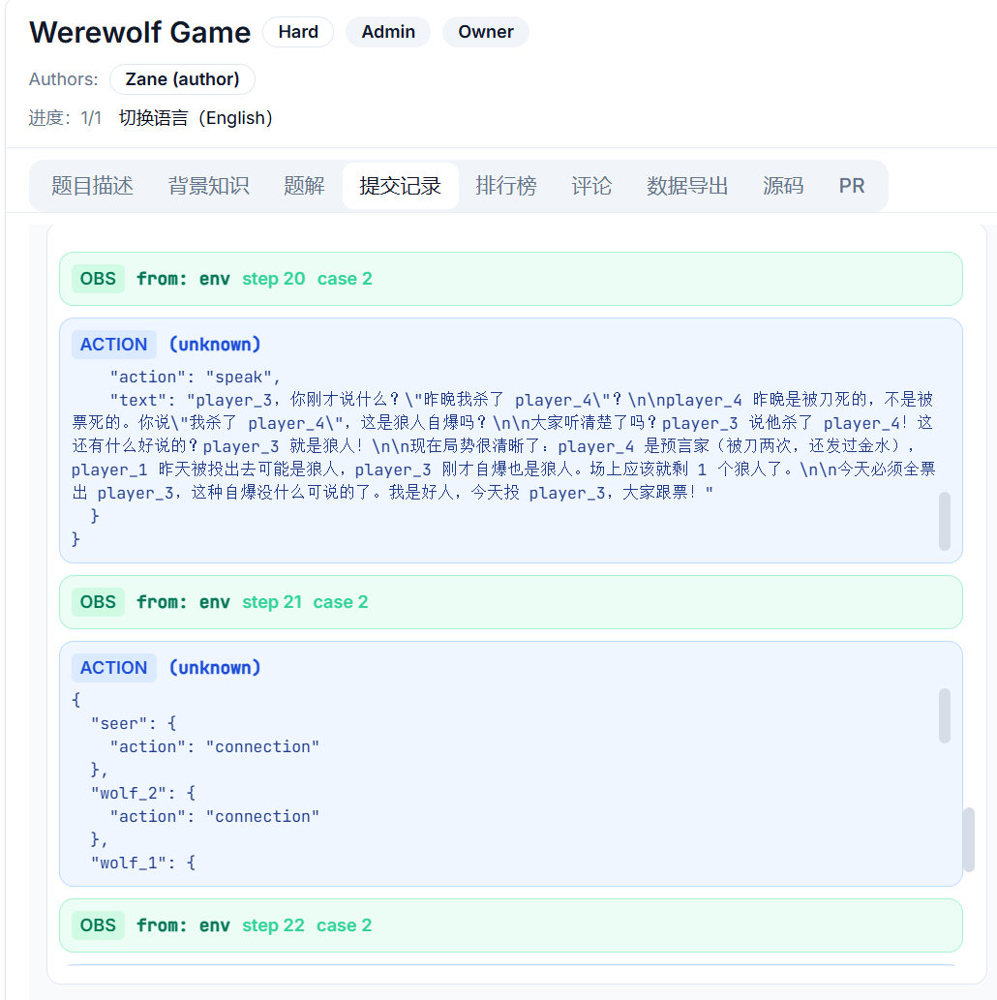

# agent-genesis

An evaluation SDK for building, registering, and running agent-based coding challenges with dual-sandbox isolation.

## Features

- Define problems with multi-phase evaluation pipelines
- Dual-sandbox architecture: isolated judge + user containers per test case
- gRPC-based communication between judge and user runtimes
- Template image pool with LRU garbage collection for fast container startup
- Concurrency control: global sandbox limits + per-submission parallelism caps
- Built-in problem registry, artifact management, and revision workflows

## Install

```bash
pip install agent-genesis
```

For server-side deployment (Docker sandbox + gRPC transport):

```bash
pip install "agent-genesis[server]"
```

## Platform

[Agent Genesis](http://82.157.250.20/problems)

* **public account for quick start:**

`Username`: genesis

`Password`:12345678

* Or you can register your own account.

## Problems

The platform includes diverse agent challenges testing different capabilities:

**Multi-Agent Coordination**
- `werewolf` - Isolated multi-agent werewolf game with role-based strategy
- `microservice_avalanche` - Distributed transaction coordination across order/inventory/payment services

**Tool Use & Planning**
- `maze` - Navigate random mazes using LLM agent with tool calls
- `tool_creator_challenge` - Dynamically create and use tools to solve queries

**Parallel Execution**
- `parallel_weather` - Query 200 cities in <27s using parallel tool calls
- `short_circuit_scraper` - Fast-fail pattern with 10 endpoints under time pressure

**Resilience & Retry Logic**
- `resilient_scraper` - Exponential backoff retry strategy with probabilistic failures

**Semantic Analysis**
- `log_hunter` - Find 3 hacker IPs in 800K tokens of access logs (high token consumption)
- `interrupt_judge` - Determine when to interrupt user utterances

**Structured Output**
- `structured_output` - Process 1000 questions with strict schema compliance in 25s

**Shopping Agent**
- `sports_shopping` - Multi-constraint shopping with 12 items, guardrails, and time limits

Each problem is in `problems/<name>/` with config, sandbox environment, and registration scripts.

## Show

`WereWolf Game`: [Agent Genesis](http://82.157.250.20/problems/15)



## Testing

Run commands from the `evaluation/` directory.

### 1) Default OSS test run (recommended)

```bash
python -m pytest -q
```

Default pytest options exclude `cross_module` tests, so contributors can run the suite without private backend credentials.

Expected outcome:
- `passed`: unit and integration tests executed locally
- `deselected`: `cross_module` tests intentionally excluded by marker filter

### 2) Coverage gate run

```bash
python -m pytest agent_genesis/tests -q \
  --cov=agent_genesis \
  --cov-config=../.coveragerc \
  --cov-report=term-missing:skip-covered
```

The coverage threshold is enforced by `.coveragerc` (`fail_under = 90`).

### 3) Cross-module backend run (optional)

```bash
python -m pytest agent_genesis/tests -q \
  -m cross_module \
  -o addopts=\"-ra --strict-markers\"
```

These tests require a live backend and environment variables such as:
- `BACKEND_URL`
- `INTERNAL_API_KEY`
- `AGENT_GENESIS_API_KEY`
- `CROSS_TEST_SLUG`
- `CROSS_TEST_SUBMIT_ID`
- `CROSS_TEST_SUBMIT_ID_CLAIMED`
- `CROSS_TEST_USER_ID`
- `CROSS_TEST_KEY_ID`

Expected outcome for this mode:
- `skipped`: environment-dependent fixtures are missing and tests self-skip with explicit reasons
- `passed`: backend and credentials are configured correctly

## License

Apache License 2.0
