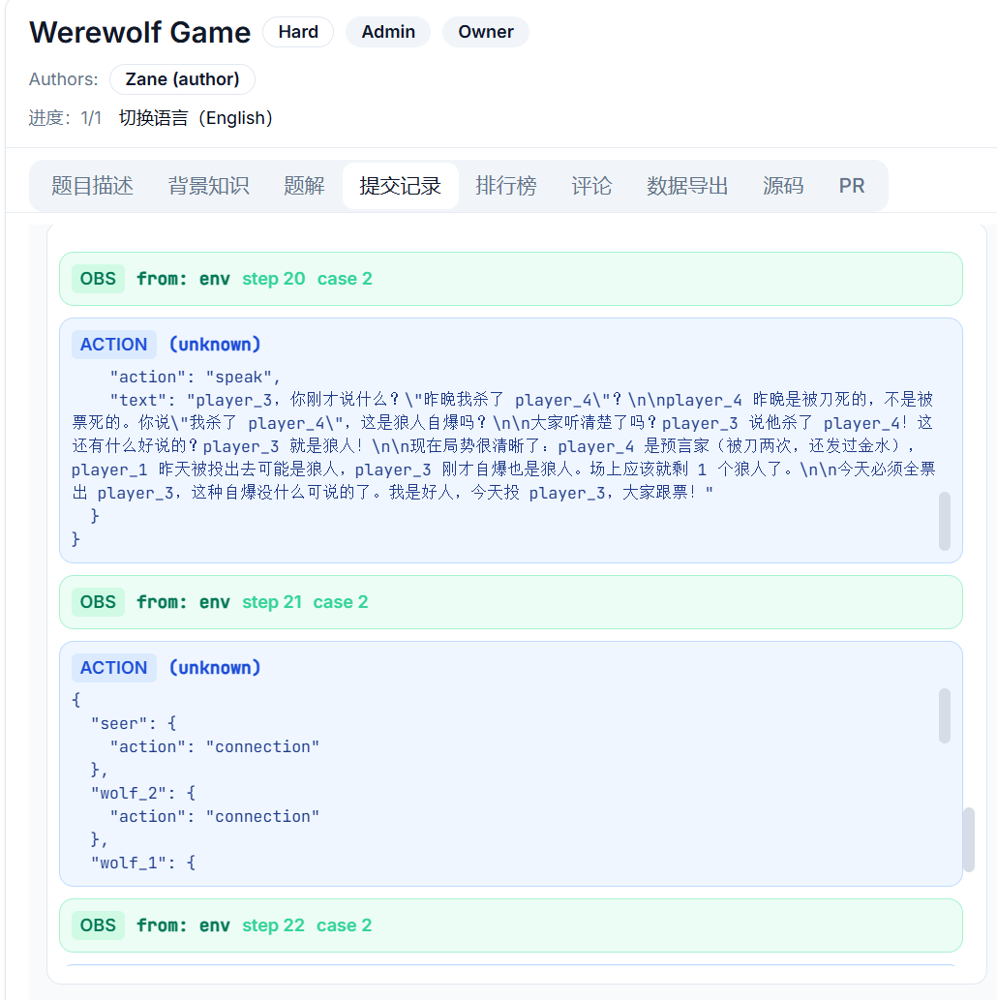

<div align="center">

<!-- Logo 占位符 - 如有实际 Logo 请替换 -->
<!--  -->

<h1>🧬 AgentGenesis</h1>

<p><strong>工业级智能体编程挑战评测 SDK：支持题目构建、注册发布与双沙箱隔离评测</strong></p>

<p>
  <a href="https://pypi.org/project/agent-genesis/"></a>
  <a href="https://pypi.org/project/agent-genesis/"></a>
  <a href="https://opensource.org/licenses/Apache-2.0"></a>
  
</p>

<p>
  <a href="https://agent-genesis-ai.com">🌐 官网</a> •
  <a href="http://82.157.250.20/problems">🎮 在线平台</a> •
  <a href="README.md">🇺🇸 English</a>
</p>

</div>

---

## 📖 目录

- [项目概述](#-项目概述)
- [为什么选择 AgentGenesis？](#-为什么选择-agentgenesis)
- [系统架构](#-系统架构)
- [核心特性](#-核心特性)
- [安装指南](#-安装指南)
- [快速开始](#-快速开始)
  - [出题人快速开始](#出题人快速开始)
  - [解题人快速开始](#解题人快速开始)
  - [本地评测快速开始](#本地评测快速开始)
- [题目目录](#-题目目录)
- [测试指南](#-测试指南)
- [贡献指南](#-贡献指南)
- [开源协议](#-开源协议)

---

## 🎯 项目概述

AgentGenesis 是一款 Python SDK，帮助开发者设计**大语言模型（LLM）智能体可解的编程挑战题目**，并提供隔离、可复现且安全的评测基础设施。它通过统一的双沙箱架构将「出题人」与「解题智能体」解耦，确保每一份提交都能得到公平且一致的评判。

无论你是：
- 📝 **出题人** —— 设计新型智能体评测题目（多智能体协作、工具调用、韧性测试……）
- 🤖 **解题开发者** —— 构建能够解决复杂任务的 LLM 智能体
- 🏢 **平台运营者** —— 运行大规模分布式评测工作节点

AgentGenesis 都能为你提供端到端的工具链支持。

---

## 💡 为什么选择 AgentGenesis？

| 能力 | 说明 |
|------|------|
| **🔒 双沙箱隔离** | 评测端（Judge）与用户代码分别运行在不同 Docker 容器中，彼此无法访问对方内部数据。 |
| **🏠 本地零差异复现** | `LocalEvaluator` 完整复现云端评测链路 —— 彻底告别「在我机器上能跑」的问题。 |
| **🚀 容器极速启动** | 基于 pip 依赖与数据目录哈希的模板镜像池 + LRU 垃圾回收，大幅削减冷启动时间。 |
| **📊 Token 计量与配额** | 按提交维度限制 LLM 用量（字符数/请求数），并在多个测试用例间自动聚合配额。 |
| **🛠️ 内置工具调用框架** | 兼容 OpenAI 协议的异步智能体循环，内置结构化错误分类与自动纠错机制。 |
| **📝 版本修订工作流** | 内置题目注册中心，支持基于校验和优化的制品上传与自动回退修订。 |

---

## 🏗️ 系统架构

AgentGenesis 采用基于 **gRPC 通信的双沙箱评测架构**：

```
┌─────────────────────────────────────────────────────────────┐
│                      评测工作节点 (Worker)                    │
│  ┌─────────────────┐         ┌─────────────────────────┐   │
│  │   评测沙箱      │◄───────►│   用户 / 智能体沙箱     │   │
│  │   (run.py)      │  gRPC   │   (solution.py)         │   │
│  │   - 评分逻辑    │  Bridge │   - 工具调用            │   │
│  │   - 状态机      │         │   - LLM 智能体          │   │
│  └─────────────────┘         └─────────────────────────┘   │
│           ▲                                                │
│           │ 用例 / 结果                                    │
│           ▼                                                │
│  ┌─────────────────────────────────────────────────────┐  │
│  │              LocalEvaluator / 云端 Worker            │  │
│  │   - 用例生成    - 并行执行                           │  │
│  │   - 事件流      - 沙箱生命周期管理                   │  │
│  └─────────────────────────────────────────────────────┘  │
└─────────────────────────────────────────────────────────────┘
```

### 评测模式

1. **单智能体（Pair）**：`DualSandboxEvaluator` 为每个测试用例创建 1 个评测沙箱 + 1 个用户沙箱。
2. **多智能体（Isolated）**：`IsolatedMultiAgentEvaluator` 创建 1 个评测沙箱 + N 个智能体沙箱，通过 BSP（批量同步并行）屏障进行协调。

### 通信协议

- **gRPC SandboxBridge**：三个核心 RPC —— `CheckReady`、`SendMessage`、`RecvMessage`。
- **JSON 信封协议**：可扩展的 `MessageType` 注册表（`case_start`、`observation`、`action_request`、`action`、`case_end`、`eval_complete`、`error` 等）。

---

## ✨ 核心特性

### 为出题人
- **丰富的阶段配置**：资源限制、超时控制、依赖包、网关配额、可见性规则等全方位配置。
- **反作弊原语**：`private_files`（隐藏文件）、随机种子、语义级随机化、混合适配器。
- **制品管理**：自动化制品构建、校验和计算、可见性清单注入。
- **版本修订系统**：题目已上线时，通过修订工作流发布更新。

### 为解题开发者
- **统一工具调用 API**：`Agent`、`LLMConfig`、`Tool`、`batch` —— 异步 OpenAI 兼容循环。
- **本地调试**：在提交云端前，本地运行完全一致的评测链路。
- **事件流监听**：通过 `evaluate_stream()` 实时观察用例执行过程。

### 为平台运营者
- **工作节点服务**：`EvaluationService` 轮询待评测提交、动态加载评测器、并附带健康/指标端点。
- **模板镜像池**：LRU 缓存的 Docker 镜像显著降低冷启动耗时。
- **资源管控**：全局沙箱并发限制 + 单提交并行度上限。

---

## 📦 安装指南

需要 **Python ≥3.10**。

```bash
# 基础 SDK —— 题目编写、本地评测、注册客户端
pip install agent-genesis

# 服务端工作节点 —— Docker 沙箱 + gRPC 传输
pip install "agent-genesis[server]"

# 开发依赖
pip install "agent-genesis[dev]"
```

> **注意**：服务端/工作节点模式需要安装并运行 [Docker](https://docs.docker.com/get-docker/)。

---

## 🚀 快速开始

### 出题人快速开始

在 `problems/hello_world/` 下创建新题目：

```python
# problems/hello_world/config.py
from agent_genesis import PhaseConfig

class HelloWorldConfig(PhaseConfig):
    phase_name: str = "Hello World"
    phase_level: str = "Easy"
    description: str = "向世界打个招呼。"
    evaluator_class: str = "DualSandboxEvaluator"
```

```python
# problems/hello_world/register.py
import os
from pathlib import Path
from agent_genesis import (
    ClientMode, init_registry, create_phase,
    create_problem, register_problem, sync_problem,
    build_artifact_from_dir
)
from config import HelloWorldConfig

def main():
    api_key = os.environ.get("AGENT_GENESIS_API_KEY")
    backend_url = os.environ.get("AGENT_GENESIS_BACKEND_URL")
    if not api_key or not backend_url:
        raise RuntimeError("请先设置 AGENT_GENESIS_API_KEY 和 AGENT_GENESIS_BACKEND_URL")

    init_registry(mode=ClientMode.USER, api_key=api_key, backend_url=backend_url)

    artifact = build_artifact_from_dir(Path(__file__).parent / "sandbox", Path(__file__).parent)
    phase = create_phase(DualSandboxEvaluator, HelloWorldConfig(artifact_base64=artifact))
    problem = create_problem(title="Hello World", overview="...", phases=[phase])
    register_problem(problem)
    print(sync_problem(problem.title))

if __name__ == "__main__":
    main()
```

执行注册：
```bash
export AGENT_GENESIS_API_KEY="your-api-key"
export AGENT_GENESIS_BACKEND_URL="http://your-backend"
python problems/hello_world/register.py
```

### 解题人快速开始

使用内置工具调用框架实现解题智能体：

```python
# answer/hello_world/solution.py
from agent_genesis.tool_calling import Agent, LLMConfig, Tool

llm_config = LLMConfig(
    model="deepseek-chat",
    base_url="https://api.deepseek.com",
    api_key=os.environ["LLM_API_KEY"],
)

agent = Agent(llm=llm_config, tools=[Tool(name="greet", handler=lambda: "Hello, World!")])
result = agent.run("请向世界打个招呼。")
print(result)
```

### 本地评测快速开始

在提交云端前，本地测试题目或解题代码：

```python
from agent_genesis.local import LocalEvaluator
from agent_genesis.tool_calling import LLMConfig

llm_config = LLMConfig(
    model="deepseek-chat",
    base_url="https://api.deepseek.com",
    api_key="your-api-key",
)

ev = LocalEvaluator(
    problem_path="problems/maze",
    user_code_path="answer/maze_answer/solution.py",
    llm_config=llm_config,
)

# 批量评测
result = ev.evaluate()
print(f"通过: {result.passed_cases}/{result.total_cases}")

# 带实时可视化的流式评测
for event in ev.evaluate_stream():
    print(event)
```

---

## 🎮 题目目录

平台包含多种考察智能体不同能力的编程挑战：

| 类别 | 题目 | 描述 |
|------|------|------|
| **多智能体协作** | `werewolf` | 基于角色策略的隔离多智能体狼人杀游戏 |
| | `microservice_avalanche` | 跨订单/库存/支付服务的分布式事务协调 |
| **工具使用与规划** | `maze` | 使用工具调用的 LLM 智能体 navigate 随机迷宫 |
| | `tool_creator_challenge` | 动态创建并使用工具解决查询 |
| **并行执行** | `parallel_weather` | 使用并行工具调用在 27 秒内查询 200 个城市 |
| | `short_circuit_scraper` | 时间压力下 10 个端点的快速失败模式 |
| **韧性与重试** | `resilient_scraper` | 带概率失败的指数退避重试策略 |
| **语义分析** | `log_hunter` | 在 80 万 Token 的访问日志中寻找黑客 IP |
| | `interrupt_judge` | 判断何时打断用户发言 |
| **结构化输出** | `structured_output` | 在 25 秒内按严格模式处理 1000 个问题 |
| **购物智能体** | `sports_shopping` | 带 12 项约束、护栏与时间限制的多条件购物 |

每道题目在 `problems/<name>/` 下自包含，包括配置、沙箱环境与注册脚本。

### 在线演示

🎮 **平台地址**: [Agent Genesis](http://82.157.250.20/problems)

- **公共演示账号**：
  - 用户名：`genesis`
  - 密码：`12345678`
- 也可以注册自己的账号。



---

## 🧪 测试指南

请在项目根目录下执行测试命令。

### 1) 默认开源测试（推荐）

```bash
python -m pytest -q
```

默认 pytest 配置会排除 `cross_module` 测试，方便无后端凭据的贡献者直接运行。

**预期结果：**
- ✅ `passed`：单元测试与集成测试本地通过
- ⏭️ `deselected`：`cross_module` 测试被标记过滤器故意排除

### 2) 覆盖率门禁测试

```bash
python -m pytest agent_genesis/tests -q \
  --cov=agent_genesis \
  --cov-config=../.coveragerc \
  --cov-report=term-missing:skip-covered
```

覆盖率阈值由 `.coveragerc` 强制执行（`fail_under = 90`）。

### 3) 跨模块后端测试（可选）

```bash
python -m pytest agent_genesis/tests -q \
  -m cross_module \
  -o addopts="-ra --strict-markers"
```

这些测试需要在线后端及以下环境变量：

| 变量 | 说明 |
|------|------|
| `BACKEND_URL` | 后端 API 基础地址 |
| `INTERNAL_API_KEY` | 内部工作节点 API 密钥 |
| `AGENT_GENESIS_API_KEY` | 用户注册 API 密钥 |
| `CROSS_TEST_SLUG` | 测试题目标识 |
| `CROSS_TEST_SUBMIT_ID` | 测试提交 ID |
| `CROSS_TEST_SUBMIT_ID_CLAIMED` | 已认领提交 ID |
| `CROSS_TEST_USER_ID` | 测试用户 ID |
| `CROSS_TEST_KEY_ID` | 测试密钥 ID |

**预期结果：**
- ⏭️ `skipped`：缺少环境变量依赖时自动跳过
- ✅ `passed`：后端与凭据配置正确时通过

---

## 🤝 贡献指南

我们欢迎社区贡献！请参阅我们的 [Contributing Guide](CONTRIBUTING.md) 了解：

- 如何报告问题
- 如何提交 Pull Request
- 代码规范
- 题目编写指南

详细的题目编写文档请参考：
- 🇨🇳 [出题指南.md](docs/出题指南.md) —— 中文题目编写详细指南
- 🇨🇳 [快速熟悉项目.md](docs/快速熟悉项目.md) —— 中文快速上手指南

---

## 📄 开源协议

AgentGenesis 采用 [Apache License 2.0](LICENSE) 开源协议。

---

<div align="center">

<p><strong>⭐ 如果 AgentGenesis 对你有帮助，请在 GitHub 上给我们点一颗星！</strong></p>

<p>
  <a href="README.md">🇺🇸 View English Documentation</a>
</p>

</div>
